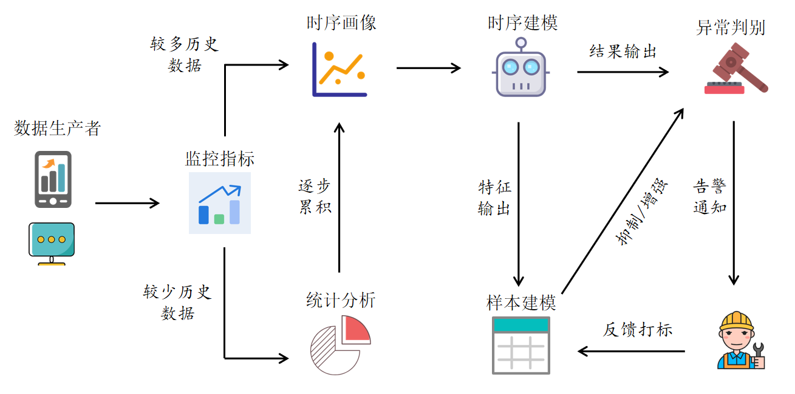
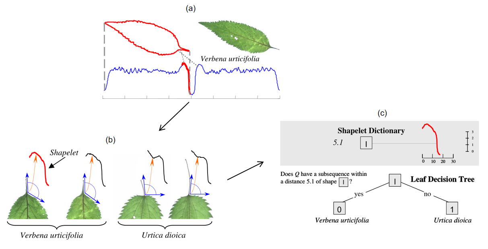
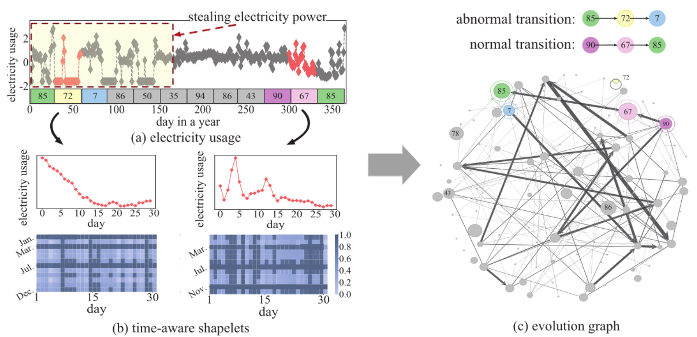
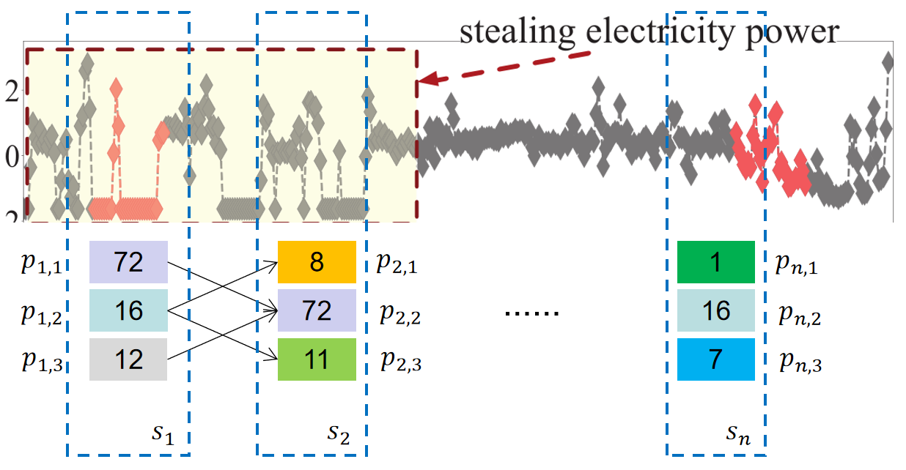
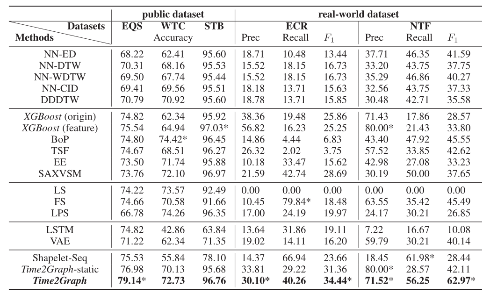
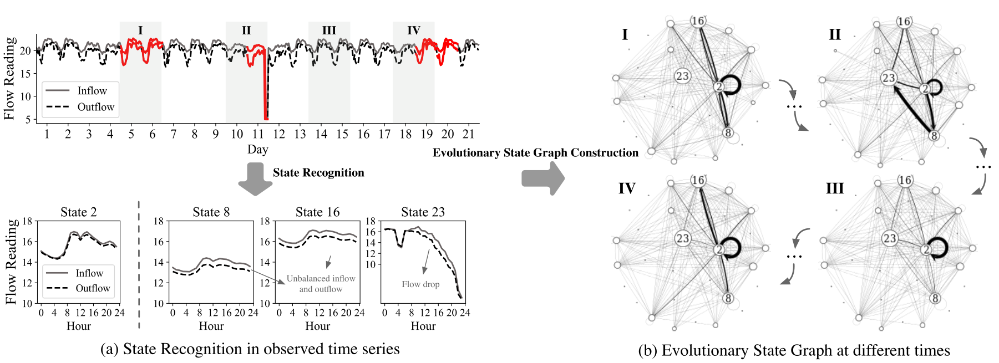
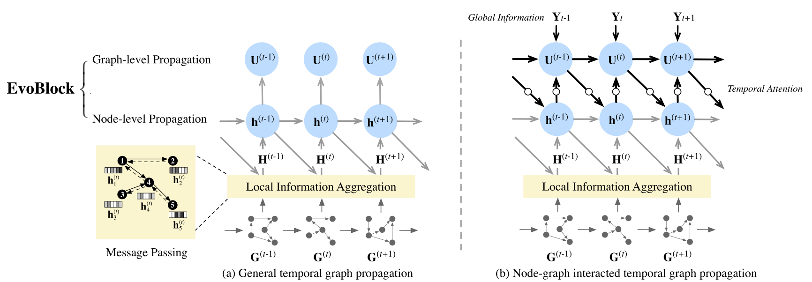
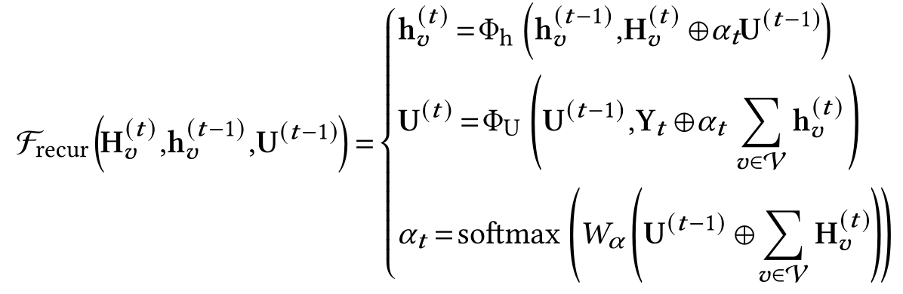
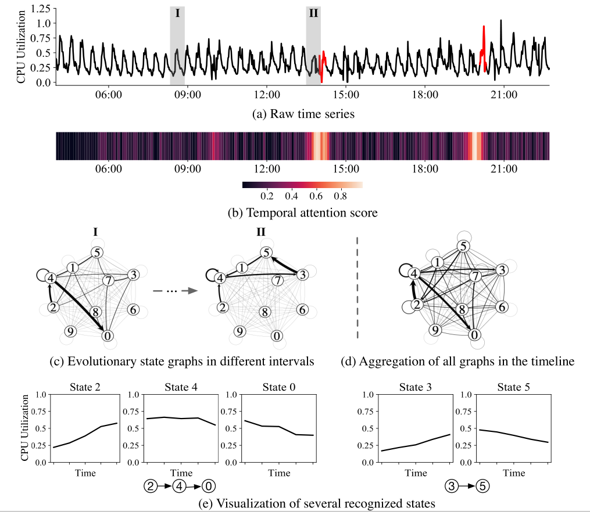

## 1. Introduction

在大规模时序数据流异常检测的场景中，现有解决方案往往基于固定的规则来分析指标数据，进而判断系统或服务的运行状态。然而，由于系统规模和复杂度的迅速攀升和业务形态的快速变换，时序数据的时效性和异构性给基于固定规则的分析方法带来了很大挑战：

- 时效性：系统的升级和变更会造成时序数据值的含义的变化，某一时刻的异常状态在另一时刻可能为正常状态；
  
- 异构性：时序数据往往具有多种表现形态，如周期性，平台缓增/递减，突变等，人工配置的规则往往难以适配复杂的形态。

针对上述问题，阿里云 SLS 推出了一款智能巡检服务$^{[1]}$，基于自研的人工智能算法，实现对监控指标数据进行整合和分析，完成异常事件的预测，并根据用户的打标信息不断优化算法。

- 当监控对象有较多的历史数据时，系统会进行时序画像的构建，主要是从业务的周期性、趋势性、波动性等几个维度去刻画，学习时序数据的状态；

- 当某个对象的时序数据较少时，系统会先退化到统计建模的策略，主要去分析指标的局部统计特征，当数据逐步累积到一定量后，再进行详细的时序画像的构建和分析。

该巡检服务涉及到的系列工作包括 **_Time2Graph(2020 AAAI)_**$^{[2]}$ 和 **_EvoNe(2021 WSDM)_**$^{[3]}$，其中前者从时序分类方法 **_Shapelet_**$^{[4]}$ 演化而来，通过提取 Time-Aware Shapelet 并构建 Shapelet 演化图来学习时间序列表征，被广泛用于时间序列建模；后者通过构建时间序列状态演化图来学习时序状态的表征以及时间序列表征，对接端到端任务，被应用于阿里云 SLS 中预测异常事件。

本文对上述两个工作进行梳理，为了方便理解，将从一个先导工作 Shapelet 开始。

## 2. Shapelet

*[paper: \<Time Series Shapelets: A New Primitive for Data Mining\> KDD 2009](http://citeseerx.ist.psu.edu/viewdoc/download?doi=10.1.1.441.710&rep=rep1&type=pdf)*

### 2.1 Intro

最近邻算法在大量实验中被认为是有效的时间序列分类算法，由于实现上的简易性，其具有较高的时间和空间复杂度，且无法对数据作出一定的解释，导致其在某些场景下不适用，如资源受限的传感器。

为了克服这些限制，文章聚焦在时间序列二分类问题上，提出了 Shapelet 方法，Shapelet（Shape 为形状，let 理解为小尾巴） 是一段具有代表性的时序子序列，能够将一个时间序列集合分为两类，其中一类和 Shapelet 相似，另一类则相反，该方法在二分类任务中达到了更高的精确度和速度，同时具有一定的可解释性，且能够扩展至多分类问题。

### 2.2 Insight

作者从对两种形状相似的叶子的观察中得到启发。对于整体观感相似的两片叶子，从全貌出发难以鉴别种类，而局部的细节往往能够起到关键性作用，如子图(b)所示，此处区别两种叶子的关键是叶柄与叶片边缘的夹角。如子图(a)所示，若将叶子用时间序列表示，则该局部特征反映为时间序列的某段子序列（即 Shapelet）。如子图(c)所示，通过将其建模为决策树，可以轻松地完成分类任务。从中可以看到 Shapelet 的优势：

- 能够提供一定的解释性：上例中分类的依据是叶柄与叶片边缘的夹角；

- 考虑局部的方法在某些数据集上更鲁棒：全局信息容易受到噪声的影响。

### 2.3 Background

- 时间序列、子序列
  - 时间序列 $T$ 是一系列按时间维度索引的值的集合，子序列 $S$ 是时间序列中的某一段，给定子序列的长度，可以利用滑动窗口从时间序列中提取出所有子序列；
$$
T=t_1,t_2,...t_m
$$
$$
S=t_p,...,t_{p+l-1},\\ 1\le p\le m-l+1,\\ l\le m
$$

- 时间序列间的距离、子序列和时间序列的距离
  - 两个长度相等的时间序列 $T_1,T_2$ 的距离 $ Dist(T_1,T_2) $ 是一个非负值，可以用多种方法衡量，如欧式距离；一个给定长度的子序列 $S$ 和一个时间序列 $T$ 的距离定义为：
$$ 
Dist(S,T)=min(Dist(S,S')) 
$$
其中 $S'$ 是 $T$ 的子序列集合中的任一子序列。

- 熵
  - 平均信息量，在分类语境下，假设包含不同类别 $A$ 和 $B$ 的时间序列数据集为 $D$，熵衡量该数据集中的分类不确定性，熵越低，不确定性越低，分类效果越好，计算方式为：
$$
I(D)=-p(A)log(P(A))-p(B)log(P(B))
$$
其中 $p(·)$ 指的是某类在数据集中的占比。

- 信息增益
  - 采用某分类策略 $st$ 后，将数据集中的样本分为不同类别，分类前后数据集熵的变化称为信息增益，较好的分类策略能够产生较大的信息增益，计算方式为：
$$
Gain(st)=I'(D)-I(D)
$$

- 最佳分割点
  - 文章采用 Shapelet 和最佳分割点作为分类策略，对于每一个候选 Shapelet，需要选择一个分割点（表现为一个阈值 $d_{th}$），将时序数据集分为两类，一类中的时序与 Shapelet 的距离小于 $d_{th}$，另一类中的时序与 Shapelet 的距离大于 $d_{th}$。对于一个候选的 Shapelet $S$ 而言，最佳分割点为 $OSP(D,S)$ 定义为：
$$
Gain(S,d_{OPS(D,S)})\ge Gain(S,d'_{th})
$$
其中 $d\'\_{th}$ 为所有可能的分割点。

### 2.4 Methodology

为了更好地完成分类任务并提供一定的可解释性见解，核心是要定义并找到时间序列数据集的 Shapelet，基于上述基本概念，文章给出了 Shapelet 定义以及获取的方法。

#### 2.4.1. Shapelet Definition

给定包含两个类别的时间序列数据集 $D$，该数据集的 **Shapelet 是一段具有代表性的特殊时序子序列，它和它的最佳分割点是能够最佳分割该数据集的分割策略**
$$
Gain(Shapelet(D),d_{OSP(D,Shapelet(D))})\ge Gain(S,d_{OSP(D,S)})
$$
其中 $S$ 是其他所有可能的子序列。

#### 2.4.2. Shapelet Extraction

文章给出了暴力搜索寻找 Shapelet 的方法，以及通过 *提前停止* 和 *熵剪枝* 等技巧来优化算法性能的方法，本文主要引入 Shapelet 的概念，具体方法可以参考论文：[_Shapelet_](http://citeseerx.ist.psu.edu/viewdoc/download?doi=10.1.1.441.710&rep=rep1&type=pdf)

## 3. Time2Graph

*[paper: \<Time2Graph: Revisiting Time Series Modeling with Dynamic Shapelets\> AAAI 2020]((http://yangy.org/works/t2g/time2graph_aaai20.pdf))*

*[code: petecheng/Time2Graph](https://github.com/petecheng/Time2Graph)*

### 3.1 Intro

同时兼顾效率和可解释性的时间序列建模是一个具有挑战性的问题。先前的工作中，Shapelet 为时序分类任务提供了可解释性见解，在许多研究中被应用。但大多数工作只关注挖掘时间序列中具有代表性的静态 Shapelet，而忽略 Shapelet 在不同时间段的不同意义及其时变演化模式，这两点对时序表征学习有重要意义。

为了解决上述问题，文章提出了 Time2Graph 方法，结合局部和全局影响因子挖掘 Time-Aware Shapelet，并构造 Shapelet 时变演化图，结合图嵌入算法来学习时间序列的表征。

### 3.2 Insight

在作者的观察中，真实世界的 Shapelet 实际上是动态的，结合用户用电的例子可以分析上述提到的两点见解：

- **Shapelet 在不同时间段具有不同的意义：** 对于普通用电用户而言，春季的低电量是正常现象，夏冬两季的低电量则可能是有助于检测窃电行为的重要信号。

- **Shapelet 时变演化关系：** 仅凭借 Shapelet 可能很难区分窃电用户和正常低耗电用户的区别，一种方法是观察 Shapelet 的演化模式，从长期表现出高耗电特征的 Shapelet 突然转变为表现低耗电特征的 Shapelet 的现象更需要被关注。
  
文章将能够反映较好地代表不同时序片段特征的时序子序列称为 Time-Aware Shapelet，将 Shapelet 的时变演化模式视为挖掘时序中关键特征的重要线索。

### 3.3 Background

- 时间序列片段
  - 给定时间序列集合 $T=\\{t_1,...t_{|T|}\\}$，其中 $t=\\{x_1,...,x_n\\}$，时间序列 $t$ 的片段（segment）是一段连续的子序列 $s=\\{x_i,...,x_j\\}$。

- 对齐 和 距离度量
  - 两个时序片段之间的距离用 $d(s_i,s_j)$ 来表示，常见的可以用欧式距离来度量。但是欧式距离无法衡量不等长的时序之间的距离，Time wrapping 则是用来解决变长时序之间距离度量的技术，核心是找到变长时序之间的对齐关系；
  
  - 给定两个时序片段 $s_i,s_j$，其长度分别为 $l_i,l_j$，对齐 $a=(a_1,a_2)$ 被定义为长度为 $p$ 的两个索引序列，满足如下条件：
    $$
        1\le a_k(a)\le ...\le a_k(p)=l_k
    $$
    $$
        a_k(n+1)-a_k(n)\le 1
    $$
    $$
        for\\ k=i,j,\\ and\\ 1\le n\le p-1
    $$

  - 将上述两个时序片段的所有可能对齐记为 $A(s_i,s_j)$，可以用 DTW(Dynamic Time Wrapping) 来度量变长时序之间的距离
    $$
        d_{DTW}(s_i,s_j)=min_{a\in A(s_i,s_j)}\tau (s_i,s_j|a)
    $$
    其中 $\tau (s_i,s_j|a)$ 是工作$^{[5]}$提出的距离度量，使该距离达到最小值的对齐记为 $a^*$；

  - 进一步可以衡量时序片段 $s$ 和时间序列 $t={s_1,...,s_m}$ 之间的距离：
    $$
        D(s,t)=min_{1\le k\le m}d(s,s_k)
    $$

- Shapelet
  - 结合上文的介绍，Shapelet 代表某一类形状，能够依赖损失函数将时序数据集分为相距较远的两类：
    $$
        \mathcal{L}=-g(S_{pos}(v,T),S_{neg}(v,T))
    $$
    其中对于 Shapelet $v$，$S_*(v,T)$ 衡量了某个时序样本集与 Shapelet 之间的距离，函数 $g$ 则衡量两个输入样本集之间的距离，可以通过信息增益或 KL 散度等方式。

### 3.4 Methodology

#### 3.4.1 Framework

借助上图一定程度上可以粗浅地把握 Time2Graph 方法框架的主体部分——将时间序列建模为有向加权图。子图(a)是已标注的真实用户年用电量数据，其中前5个月存在窃电现象，Time2Graph 的目标是整个时间序列建模为图，从中得到针对“如何发现窃电行为”问题的一些见解。具体做法是：

- 首先，从时序数据中获取 Shapelet，将其以编号的形式，按照一定的概率分配给时间序列的每一个片段（图中将时间序列按月份分为12个片段），如 Shapelet82 能够代表1月的用电数据的特征，Shapelet72 则更能将2月用电数据的特征与其他月份区分开；
  
- 随后，以各片段 Shapelet 为结点，相邻时序片段 Shapelet 的转化关系为边构建 Shapelet 演化图，边的权值和相邻结点 Shapelet 的分配概率有关，该演化图刻画了完整时间维度上的 Shapelet 演化关系。从演化关系图中可以进一步得出异常检测的见解，正常用电用户存在普遍存在一条 Shapelet 演化路径，如 90→67→85，当发现一条罕见的演化路径时，如85→72→7，需要警戒是否发生了异常（窃电）现象。

- 最后，考虑从图中学习完整时间序列的表征。

从上述分析中可以总结出 Time2Graph 需要考虑的三个问题：

- 如何提取 Time-Aware Shapelet 并分配给不同的时序片段；

- 如何构建 Shapelet 演化图；

- 如何设计表示学习算法从图中学习时间序列表征。

#### 3.4.2 Time-Aware Shapelet Extraction

文章定义了两个层级的时间影响因子来提取 Shapelet 的时间效应。

- 局部影响因子 $\omega _n$
  - 引入局部影响因子来捕获 Shapelet 的第 $n$ 个元素的重要性，修正距离度量函数为：
    $$
        \hat{d}(v,s | \omega) = \tau (v,s | a*,\omega) = (\Sigma^p_{k=1}\omega_{a_1^\*(k)}·(v_{a_1^\*(k)}-s_{a_2^\*(k)})^2)^{\frac{1}{2}}
    $$

- 全局影响因子 $u_m$
  - 引入全局影响因子来衡量不同时间片段的 Shapelet 的重要程度，直观的想法是为各片段添加权重来实现，进一步修正距离函数：
    $$
        \hat{D}(v,t | w,u) = min_{1\le k\le m}u_k·\hat{d}(v,s_k | \omega)
    $$

利用该距离度量方法，可以基于一定的准则学习每个 Shapelet 的参数 $\omega ,u$，给定一个时序分类任务的数据集，利用监督学习方法来挖掘最具代表性的 Shapelet，结合距离度量函数修正3.3节提到的损失函数：
$$
    \hat{\mathcal{L}}=-g(S_{pos}(v,T),S_{neg}(v,T))+\lambda ||\omega||+\epsilon ||u||
$$
从时间序列的所有子序列中选出 Time-Aware Shapelet 的候选者，为所有候选者学习两级时间影响因子，选出 $\mathcal{L}$ 最小的 $K$ 个 Shapelet 用于后续步骤。

#### 3.4.3 Shape Evolution Graph

Shapelet 演化图刻画了整个时间维度上 Shapelet 的演化模式，其表现为有向加权图，图中的结点为 Shapelet，边为演化路径，边权值代表演化概率，构建步骤如下：

- 以一定的分配概率给不同的时序片段分配 Shapelet（对应编号），分配的原则是该 Shapelet 和该时序片段的距离小于一个经验设定的阈值 $\delta$，假设为时序片段 $s_i$ 分配的所有 Shapelet 记为 $v_{i,*}$，$v_{i,j}$ 表示为该片段分配的第 $j$ 个 Shapelet，对应的分配概率为：
  $$
    p_{i,j}=\frac{max(\hat{d_{i,\*}}(v_{i,\*},s_i))-\hat{d_{i,j}}(v_{i,j},s_i)}{max(\hat{d_{i,\*}}(v_{i,\*},s_i))-min(\hat{d_{i,\*}}(v_{i,\*},s_i))}
  $$
  其中 $\hat{d_{i,\*}}(v_{i,\*},s_i)$ 对应上述提到的带有局部时间影响因子的度量函数，同时满足约束条件 $\hat{d_{i,\*}}<\delta$；

  

- 在上步中，Shapelet $v_{i,\*}$ 以概率 $p_{i,\*}$ 分配给时序片段 $s_i$，$v_{i+1,\*}$ 以概率 $p_{i+1,\*}$ 分配给时序片段 $s_i+1$，其中 $s_i$ 和 $s_{i+1}$ 是两个相邻的时序片段，对于每一对标号 $(j,k)$，以权重 $p_{i,j}·p_{i+1,k}$ 在结点 $v_i$ 和 $v_{i+1}$ 之间创建一条有向边，最后合并有向边上的所有权重概率并做归一化，得到完整的 Shapelet 演化图。

#### 3.4.4 Representation Learning

在表征学习阶段，为图中的结点和整图学习表征向量，具体采用经典的图嵌入算法 [_DeepWalk_](https://arxiv.org/pdf/1403.6652.pdf)$^{[6]}$ 学习结点级别的表征 $ \mu \in \Bbb{R}^B $。对于时间序列 $t=\\{ s_1,...,s_m\\}$ 中的每一个时序片段 $s_i$，将分配给其的 Shapelet 的表征与分配概率相乘后求和，得到该时序片段的表征，如果存在无法分配 Shapelet 的时序片段，则它的表征向量为空，时序片段表征向量计算如下：
$$
    \Phi_i = (\Sigma_j p_{i,j}·u(v_{i,j})),\\ 1\le i\le m
$$
最终，串联所有时序片段的表征，可以得到整个时间序列的表征。

### 3.5 Experiments

文章基于几个公开数据集做了时序分类实验，选择 XGBoost 作为 Time2Graph 的下游分类器，实现细节和参数设置等参考仓库：[_Github-Time2Graph_](https://github.com/petecheng/Time2Graph)

## 4. EvoNet

*[paper: \<Time-Series Event Prediction with Evolutionary State Graph\> WSDM 2021](https://arxiv.org/pdf/1905.05006.pdf)*

*[code: VachelHU/EvoNet](https://github.com/VachelHU/EvoNet)*

### 4.1 Intro

针对时序数据的未来事件（如异常）预测是一个重要的研究课题，预测的精确性和可解释性很大程度依赖于对观测数据状态的挖掘，现有方法通常通过使用潜在表征对时序数据编码或提取时序数据的静止状态来帮助事件预测，往往忽略状态之间的互相影响，难以兼得好的预测效果和可解释性。为了联合建模时序的状态及其相互间影响，Time2Graph 在图结构上做出了探索和尝试，但其在整个时间线上构建一个静态图，没能考虑到状态的变化关系，如图级和结点级的迁移。

为了挖掘时序数据状态的演变关系，更好地进行事件预测，文章提出了新的**时序事件预测框架**，其根据时序片段的状态对时间序列建模，利用有向图来建模相邻时序片段之间的状态转换关系，构建状态演化图，并提出了新的 GNN 模型 EvoNet，利用时间注意力机制建模图级和结点级的传播，学习图和结点的表征，用于未来事件预测。

### 4.2 Insight

在对运动健康监测数据的观察中发现，从剧烈跑动中突然停下可能健康监测数据发生异常，原因是突然停止剧烈运动可能导致昏厥发生，而停止慢跑则不会让健康监测数据表现出异常。同样地，从网上购物记录来看，用户的兴趣从电子产品到化妆品的转变比从化妆品到时尚衣物的转变更令人生疑。这些例子本质上都反映了状态切换对解释事件带来了一些见解。作者从对此类真实世界数据的观测中得出启发，将对时序数据状态演化过程的建模视为理解事件的重要线索。

### 4.3 Background

- 时间序列事件预测
  - 含有 $T$ 个时序片段的时间序列 $X$ 和事件序列 $Y$ 可以表示为：
    $$
        <X_{1:T},Y_{1:T}> = \\{(X_1,Y_1),(X_2,Y_2),...,(X_T,Y_T)\\}
    $$
    其中 $X_t\in \Bbb{R}^{\tau × d}$ 和 $Y_t\in \Bbb{Z}$ 分别代表时序片段和该片段代表的事件（如该片段代表指标正常或异常），$d$ 是时间序列的维度，$\tau$ 是一个超参数，往往具有实际意义（如一天24h）。每个时序片段是一个连续的时序子序列 $X_t=\\{x_1,x_2,...,x_{\tau}\\}$，$x_i\in \Bbb{d}$ 是第 $i$ 步的观测值。给定观测序列 $<X_{1:T},Y_{1:T}>$，文章目标是建模给定观测序列的状态演化过程，从而预测下一时序片段对应的事件 $Y_{T+1}$。

- 状态
  - 时序的状态 $v$ 是具有代表意义的时序片段，记为 $\Theta \in \Bbb{R}^{\tau×d}$，已有多种方法如子序列聚类，Shapelet 和 Bag of Patterns 等来挖掘时序的状态，文章对此不设限。

- 片段-状态的表征
  - 一旦识别出时间序列的状态，则可以将时序片段建模为若干状态的组合，这些状态带有不同的组合权重。给定时序片段 $X_t$ 和状态 $\Theta_v$，该状态对于该时序片段的权重用一种相似性度量来表示：
  $$
    P(\Theta_v|X_t)=\frac{max([\mathscr{D}(X_t,\Theta_v)])-\mathscr{D}(X_t,\Theta_v)}{max([\mathscr{D}(X_t,\Theta_v)])-min([\mathscr{D}(X_t,\Theta_v)])}, \\ v\in \mathscr{V}
  $$
  其中 $\mathscr{D}(X_t,\Theta_v)$ 为时序距离度量函数，可以通过多种现有方法实现。

### 4.4 Methodology

#### 4.4.1 Framework

上图展示了 EvoNet 框架的主体部分——识别时序数据的状态并构建状态演化图，识别出的状态被以一定的概率分配给不同的时序片段，是有向加权图中的结点。对于包含多个片段的时间序列，按时间维度构建一系列的有向加权图，上图所示的有向加权图Ⅰ~Ⅳ分别对应时序数据中的片段Ⅰ~Ⅳ，对于有向图Ⅰ而言，其中的边代表状态之间的转移关系，具体而言，是时序片段Ⅰ的前一片段到时序片段Ⅰ演变的过程中，两者被分配的状态之间的转移关系，边的粗细代表转移关系的权重。获得一系列有向加权图后，EvoNet 使用新的 GNN 模型来学习具体时序片段对应有向图的结点级和图级表征。

因此，EvoNet 主要聚焦于解决两大问题：

- 如何构建状态演化图；

- 如何设计表示学习算法学习在系列有向图中学习结点级和图级的表征。

#### 4.4.2 Evolutionary State Graph

- 状态演化图的定义
  
  - 文章将状态演化图定义为一系列有向加权图 $G^{(1:T)}$。其中每张图 $G^{(t)}=\\{\mathcal{V},\mathcal{E^{(t)}},\mathcal{M^{(t)}}\\}$ 刻画了时序数据由片段 $X_{t-1}$ 向 $X_t$ 演化的过程中状态的转移关系，图中的结点为状态，边 $e_{(v,v')}^{(t)}\in \mathcal{E^{(t)}}$ 代表片段演化过程中状态 $v$ 向状态 $v'$ 的转变路径，假设每个时序片段状态的分配是相互独立的，边的权重 $m_{(v,v')}^{(t)}\in \mathcal{M^{(t)}}$ 的计算方式为：
  $$
    m^{(t)}_{(v,v')}=\bf{P}({\Theta} _{(v,v')}|X _{(t-1,t)})=\bf{P}({\Theta} _{v}|X _{t-1})×\bf{P}({\Theta} _{v'}|X _{t})
  $$
  状态演化图通过对每个时序分段的多个状态及其转移关系进行建模，在时间轴上保留了原始数据的更多信息，能够提供更丰富的解释，同时具备基于状态表示时序的方法对全局噪声的鲁棒性。

- 状态演化图的分析
  
  - 分析 4.4.1 节中的图，该时序数据取自 NetFLow 数据集，刻画了网络流流入和流出的数值随时间变化的关系。时序片段Ⅲ为正常片段，系统主要维持在状态2；而在片段Ⅰ发生异常时，由有向图Ⅰ可以明显看到状态 2 向状态 16 和状态 8 的转移增加，通过对各状态本身的分析发现，状态 2 代表了一种稳定的网络流模式，状态 16 和状态 8 都表示了不均衡的网络流现象，因此该转变意味着系统发生了某异常，这是状态分析对事件预测提供的见解；
  
  - 进一步分析有向图的属性，可以发现当异常发生时，图将变得更加密集，体现为 Betweenness 值降低而 Closeness 值升高，同时对结点属性的分析也可以发现，当异常发生时，特定结点的入度将显著提升。因此，图级和结点级的演化带来图结构的迁移在一定程度上能够反映事件的发生，在后续的表征学习中，将着重捕获这两个层次上的信息。

#### 4.4.3 Evolutionary State Graph Network

EvoNet 被设计用于学习系列有向加权图中结点级和图级的表征，聚焦于捕获两类信息：

- 局部结构影响：考虑一个状态，若其由不同的状态转换而来，可能导致不同的结果；

- 时间影响：先前时间片段中的状态转换可能影响当前的观测数据。

状态演化图中自然地包含了上述两类特征，其中局部结构影响由每张图中结点之间的联系决定，时间影响则由图的一系列演化过程产生。

在系列有向加权图 $G^{(1:T)}$ 中的图 $G^{(t)}$，定义结点 $v$ 的表征向量为 $h_v^{(t)}\in \Bbb{R}^{|h|}$，图的表征向量为 $U^{(t)}\in \Bbb{R}^{|U|}$。为了学习上述两级表征，EvoNet 采用消息传递机制聚合局部结构信息，并设计了一个循环结构 **EvoBlock** 来合并随时间传播的信息。

**局部信息聚合**  EvoNet 旨在让相邻的结点具有类似的表征，为了达成这个目的，使图中的结点聚合其邻居的消息，重新计算自身的表征，参照 MPNN，聚合策略可以表示为：
$$
H_v^{(t)}=\Sigma _{v'\in N(v)} \mathcal{F} _{MP}(h _{v'}^{(t-1)},e _{v,v'}^{(t)})
$$
其中，消息传播函数 $\mathcal{F} _{MP}$ 可以参照现有方法的多种实现方式，如GGNN、GCN、GraphSAGE、GAT等，在 EvoNet 中是一个可调整的模块。

**时间图传播**  为了捕获图在时间维度上动态变化的历史信息（包括图级和结点级的信息），EvoNet 通过一个循环结构 EvoBlock 来聚合此类信息。具体而言，该结构通过结合当前局部信息 $H^{(t)}_v$ 和上一时序片段的表征 $(h_v^{(t-1)},U^{(t-1)})$，表示为：
$$
h_v^{(t)},U^{(t)}:=\mathcal{F} _{recur}(H_v^{(t)},h_v^{(t-1)},U^{(t-1)}), \\ for\\ v\in \mathcal{V}
$$
如子图(a)所示，现有方法多在结点级别的传播上利用简单的RNN来实现函数 $\mathcal{F} _{recur}$，对于图级的传播，仅仅由当前时间步的结点级表征求和得到。为了改善事件预测的性能，EvoNet 的 $\mathcal{F} _{recur}$ 函数建模图级传播时需要考虑前一时序片段对应的事件，再通过图-结点的交互影响模式将信息传递至结点，具体而言，通过一种时间注意力机制来实现：

其中符号 $\oplus$ 是串联操作符；时间注意力分数 $\alpha _t$ 用来捕获历史时序片段中重要的信息，实现图-结点的信息交互，在不同的时间步使用 Softmax 进行标准化；函数 $\Phi _{\*}(·,·)$ 用于计算不同层级的表征，可以有多种实现方式，在 EvoNet 中不设限。

**端到端学习**  给定到第 $t$ 个时序片段的有向图系列，EvoNet 可以获得结点表征 $h_v^{(t)}$ 和图表征 $U^{(t)}$，二者可以被进一步用于预测下一个时序片段对应的事件 $Y_{t+1}$，具体而言，可以通过一个全连接层合并两级表征：
$$
h_G^{(t)}=\mathcal{F} _{fc}(U^{(t)} \oplus \Sigma _{v\in \mathcal{V}}h_v^{(t)})
$$
随后通过对接分类器（如XGboost），利用端到端框架学习模型参数，完成事件预测。

### 4.5 Experiments

EvoNet 框架中有很多模块是可更换的，可以衍生不同的变体。在实验设置中，EvoNet 采用 K-means 来识别时序的状态，利用 GGNN 实现消息传递。详细的实验设置参考原文，此处主要介绍 EvoNet 的一个应用案例。

**应用案例**  EvoNet 被用于阿里云 SLS 服务中进行时序异常事件的预测。针对 CPU 利用率数据，EvoNet 对 10 个状态进行聚类并分配给不同的时序片段，构建状态演化图，并进行异常事件预测，结果如上图所示，验证了 EvoNet 的优势：

- **时间注意力机制的有效性**：通过对时间注意力分数 $\alpha _t$ 的热图可视化，可以看出其 Highlight 了异常事件发生的位置，表示该注意力机制有助于捕获重要的时间信息；

- **状态演化图的可解释性**：图中标记了正常时序片段Ⅰ和异常时序片段Ⅱ，对应子图(c)中的有向图，在时序片段Ⅰ中，状态 2 → 4 → 0 是一个主要的转移路径，3 → 5 是片段Ⅱ中的主要转移路径，聚合整个时间轴的有向图后（子图(d)）可见 3 → 5 是一条罕见的路径，也是导致片段Ⅱ发生异常的主要原因。进一步地，在子图(e)中可以进一步理解该异常，即 2 → 4 → 0 代表了一个服务进程处理，CPU 利用率缓增、维持、缓降，而 3 → 5 显示 CPU 利用率缓增后立刻下降，可能是发生了 CPU 类的故障。

## Reference

[1] 阿里云SLS智能巡检：https://mp.weixin.qq.com/s/08MOXP6rpigjy2JydfQmvw

[2] Cheng Z, Yang Y, Wang W, et al. Time2graph: Revisiting time series modeling with dynamic shapelets[C]//Proceedings of the AAAI Conference on Artificial Intelligence. 2020, 34(04): 3617-3624.

[3] Hu W, Yang Y, Cheng Z, et al. Time-series event prediction with evolutionary state graph[C]//Proceedings of the 14th ACM International Conference on Web Search and Data Mining. 2021: 580-588.

[4] Ye L, Keogh E. Time series shapelets: a new primitive for data mining[C]//Proceedings of the 15th ACM SIGKDD international conference on Knowledge discovery and data mining. 2009: 947-956.

[5] Müller, M. 2007. Dynamic time warping. IRMM’07 69–84. Peng, X.; Huang, J.; Hu, Q.; Zhang, S.; and Metaxas, D. N. 2014. Head pose estimation by instance parameterization. In ICPR’14, 1800–1805.

[6] Perozzi B, Al-Rfou R, Skiena S. Deepwalk: Online learning of social representations[C]//Proceedings of the 20th ACM SIGKDD international conference on Knowledge discovery and data mining. 2014: 701-710.